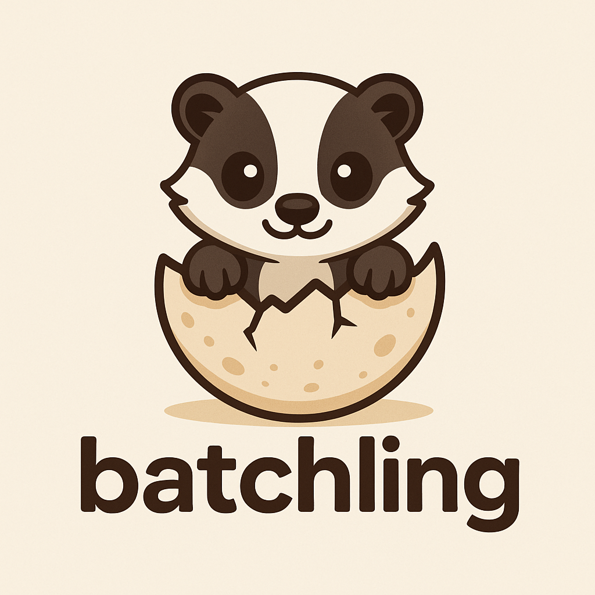

# batchling

<div align="center">

</div>
<p align="center">
    <em>batchling is the universal GenAI Batch API client. Create, manage and run batch experiments on any GenAI provider.</em>
</p>
<p align="center">
<a href="https://github.com/vienneraphael/batchling/actions/workflows/ci.yml" target="_blank">
    
<a href="https://pypi.org/project/batchling" target="_blank">
    
</a>
</p>

---

batchling is a python library to abstract GenAI Batch API usage. It provides a simple interface to create, manage and run batch experiments on any GenAI provider.

<details>

**<summary>What is a Batch API?</summary>**

Batch APIs enable you to process large volumes of requests asynchronously (usually at 50% lower cost compared to real-time API calls). It's perfect for workloads that don't need immediate responses such as:

- Running mass offline evaluations
- Classifying large datasets
- Generating large-scale embeddings
- Offline summarization
- Synthetic data generation
- Structured data extraction (e.g. OCR)

Compared to using standard endpoints directly, Batch API offers:

- **Better cost efficiency**: usually 50% cost discount compared to synchronous APIs
- **Higher rate limits**: Substantially more headroom with separate rate limit pools
- **Large-scale support**: Process thousands of requests per batch
- **Flexible completion**: Best-effort completion within 24 hours with progress tracking, batches usually complete within an hour.

</details>

## Table of contents

- [batchling](#batchling)
  - [Table of contents](#table-of-contents)
  - [Common issues with Batch APIs](#common-issues-with-batch-apis)
  - [Why use batchling?](#why-use-batchling)
  - [Supported providers](#supported-providers)
  - [Installation](#installation)
  - [CLI](#cli)
    - [Create an experiment (CLI)](#create-an-experiment-cli)
    - [Start an experiment (CLI)](#start-an-experiment-cli)
    - [Retrieve results](#retrieve-results)
  - [Python SDK](#python-sdk)
    - [Create an experiment (Python)](#create-an-experiment-python)
    - [Retrieve results (Python)](#retrieve-results-python)

## Common issues with Batch APIs

Batch APIs offer clear and simple functionality. However, some aspects of managing batches are not straightforward:

- **Multi-provider support**: There is no standard interface for batch APIs. If you were to compare major providers on a given job, you'd have to write duplicate code for each provider.
- **File Management**: Each provider requires you to manage files on your own, leading to poor data management and experiment monitoring.
- **Error Handling**: it's not easy to retrieve and re-run batch failed samples automatically.
- **Structured Output Generation**: generating structured outputs with pydantic models in Batch APIs requires some tricks and is tiresome.
- **Batch Creation**: By default, Batch APIs require you to build your own batch creation logic, which is prone to errors.
- **Usage**: Most Batch APIs require you to write code to create, manage and run experiments and do not provide a CLI.

## Why use batchling?

batchling aims to solve the most common issues with Batch APIs:

- **Multi-provider support**: The goal behind batchling is to maintain a unified interface for all providers, allowing you to gain access to all models available on the market for your batch jobs.
- **File Management**: batchling provides you with a local database to store your experiments and results.
- **Error Handling**: batchling provides you with the right tools to re-run failed samples.
- **Structured Output Generation**: batchling takes care of that for you: simply define your pydantic model and batchling will handle the rest.
- **Batch Creation**: batchling implements a smart templating system to help you design experiments.
- **Usage**: batchling provides a CLI to create, manage and run experiments with a single command, empowering all kind of users to run batch experimentations.

## Supported providers

As of now, batchling supports the following providers:

| Name        | Batch API Docs URL                                                       |
|-------------|--------------------------------------------------------------------------|
| OpenAI      | <https://platform.openai.com/docs/guides/batch>                          |
| Anthropic   | <https://docs.anthropic.com/en/docs/build-with-claude/batch-processing>  |
| Gemini      | <https://ai.google.dev/gemini-api/docs/batch-mod>                        |
| Groq        | <https://console.groq.com/docs/batch>                                    |
| Mistral     | <https://docs.mistral.ai/capabilities/batch/>                            |
| Together AI | <https://docs.together.ai/docs/batch-inference>                          |

For more information regarding model support and pricing details, refer to the Batch API Docs linked.

## Installation

```bash
pip install batchling
```

## CLI

### Create an experiment (CLI)

Suppose we have the following files:

- `request_file.jsonl`

```json
{"system_prompt": "You are a helpful assistant.", "messages": [{"role": "user", "content": "What is the capital of France?"}]}
{"system_prompt": "You are a helpful assistant.", "messages": [{"role": "user", "content": "What is the capital of Italy?"}]}
{"system_prompt": "You are a helpful assistant.", "messages": [{"role": "user", "content": "What is the capital of Belgium?"}]}
```

We can create an experiment with the following command:

```bash
batchling create\
 --name my-experiment-1\
 --model gpt-4o\
 --title "exp name"\
 --description "exp description"\
 --provider openai\
 --endpoint /v1/chat/completions\
 --raw-file-path request_file.jsonl\
 --processed-file-path input_capitals_openai.jsonl\
 --results-file-path output/result_capitals_openai.jsonl\

# ╭──────────────── my-experiment-1 ─────────────────╮
# │ Name: my-experiment-1                            │
# │ Title: exp name                                  │
# │ Description: exp description                     │
# │ Provider: openai                                 │
# │ Endpoint: /v1/chat/completions                   │
# │ Model: gpt-4o                                    │
# │ Status: created                                  │
# │ Processed File Path: input_capitals_openai.jsonl │
# │ Results File Path: output/result_capitals.jsonl  │
# │ Created At: 2025-09-01 13:17:43                  │
# ╰──────────────────────────────────────────────────╯
```

### Start an experiment (CLI)

```bash

batchling start my-experiment-1

# > Experiment with name: my-experiment-1 is started. Current status: validating
```

### Retrieve results

```bash
# Once batch is completed
batchling results my-experiment-1

# > Downloading results..
# > Results downloaded to output/result_capitals.jsonl

cat output/result_capitals.jsonl

```json
{"id": "batch_req_68b2f87a872c8190b1b5bdc9fdd9c3e0", "custom_id": "my-experiment-1-sample-0", "result": "The capital of France is Paris."}
{"id": "batch_req_68b2f87c0e0c819095904fe9a1f5430d", "custom_id": "my-experiment-1-sample-1", "result": "The capital of Italy is Rome."}
{"id": "batch_req_68b2f87aadc08190a0ee50b9a8453b4c", "custom_id": "my-experiment-1-sample-2", "result": "The capital of Belgium is Brussels."}
```

## Python SDK

### Create an experiment (Python)

```python
from batchling import ExperimentManager
from batchling.request import RawRequest, RawMessage

em = ExperimentManager()

# Create raw requests with system prompt and messages
raw_requests = [
    RawRequest(
        system_prompt="You are a helpful assistant.",
        messages=[
            RawMessage(role="user", content="What is your name? Mine is Bob.")
        ]
    )
]


experiment = em.create_experiment(
    experiment_name="my-experiment-1",
    model="gpt-4o-mini",
    provider="openai",
    endpoint="/v1/chat/completions",
    title="My first experiment",
    description="Experimenting with gpt-4o-mini",
    raw_requests=raw_requests,
    processed_file_path="path/to/write/input.jsonl",
    results_file_path="path/to/write/output.jsonl",
)

# submit the local input file and batch to provider
em.start_experiment(experiment_name=experiment.name)

# monitor experiment status and wait for it to complete
print(experiment.status)
# > "running"
```

### Retrieve results (Python)

```python
from batchling import ExperimentManager

em = ExperimentManager()

experiment = em.retrieve(experiment_name="my-experiment-1")

results = em.get_results(experiment_name=experiment.name)
print(results)
# [
#     {"id": "batch_req_6872c8dsa872c8190b1b5bdcq0d9q9z", "custom_id": "my-experiment-1-sample-0", "result": "My name is Bob."},
#     {"id": "batch_req_68b2f87c0e0c88b2f87a872c8dsape2", "custom_id": "my-experiment-1-sample-1", "result": "My name is Alice."},
# ]
```
