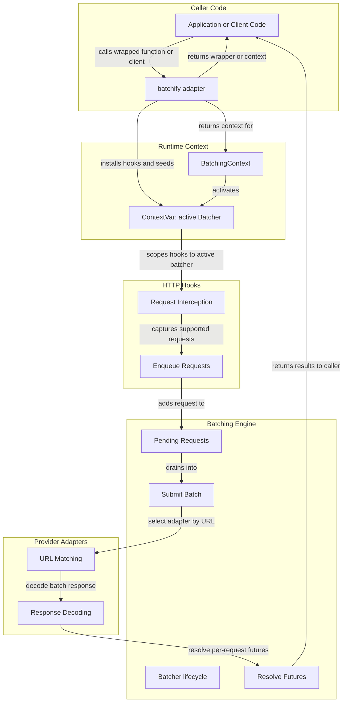

# Architecture Overview

## Notes

1. `batchify` wraps a function or client instance and installs hooks.
2. `BatchingContext` activates the context variable that holds the active `Batcher`.
3. HTTP hooks capture supported requests and enqueue them into the `Batcher`.
4. The `Batcher` batches pending requests, submits them, and resolves per-request futures.
5. Provider adapters normalize URLs and decode batch results into responses.
