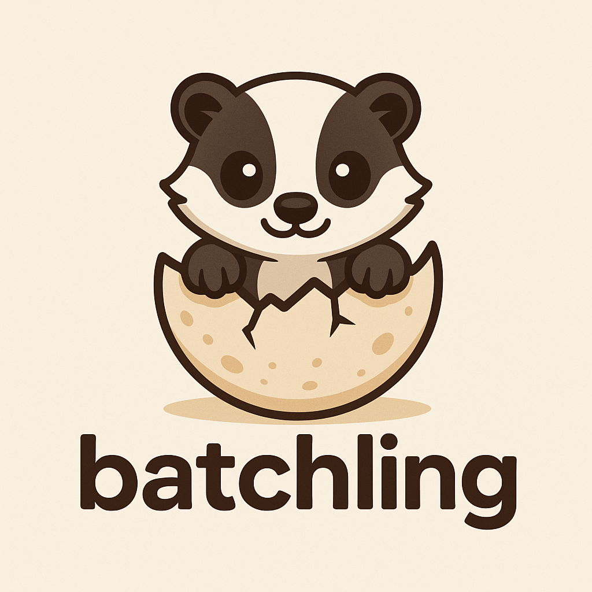

# Batchling

Batchling helps you run supported GenAI calls through provider batch APIs with minimal code changes.

## Who this is for

- Teams running async AI workloads that can complete later (minutes to hours).
- Developers who want lower API costs for offline or deferred jobs.
- Python users integrating OpenAI-compatible or supported provider clients.

## Fastest path to value

1. Install `batchling`.
2. Wrap your async workload in `batchify()`.
3. Run and let Batchling route supported requests to provider batch APIs.

## Start here

- Quickstart: [Getting Started](getting-started.md)
- Runtime and queue tuning: [Configuration](configuration.md)
- Provider compatibility: [Providers](providers.md)
- Issue resolution: [Troubleshooting](troubleshooting.md)

## Need internals?

Implementation details are in the [Architecture](architecture/overview.md) section.
